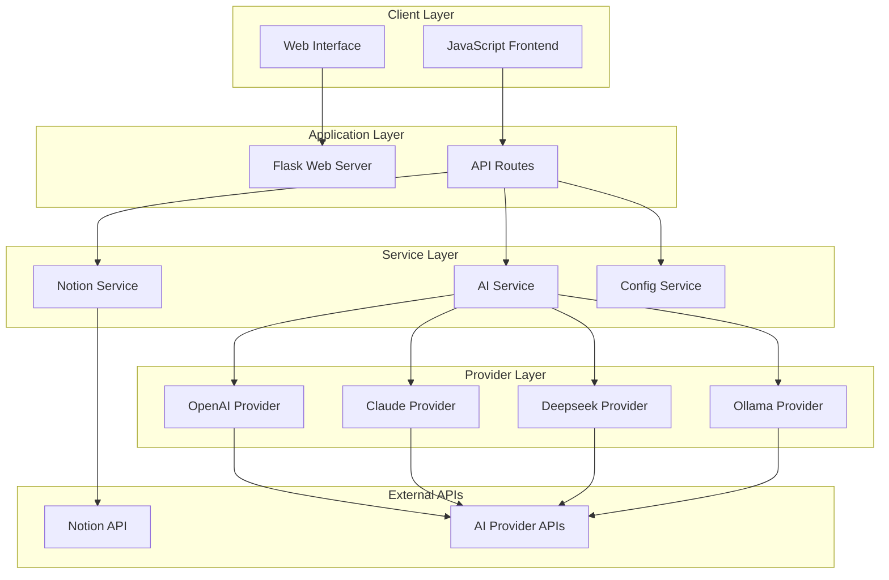

# Design Document

## Overview

The Notion AI Integration System is a Flask-based web application that provides a seamless interface between Notion workspaces and multiple AI providers. The system follows a modular architecture with clear separation of concerns, enabling users to interact with their Notion content through AI-powered features via a modern web interface.

## Architecture

### High-Level Architecture



### Technology Stack

- **Backend**: Flask (Python web framework)
- **Frontend**: HTML templates with JavaScript for dynamic interactions
- **AI Integration**: OpenAI SDK, Anthropic SDK, custom HTTP clients
- **Notion Integration**: Official Notion Python client
- **Configuration**: Python modules with environment variable support

## Components and Interfaces

### Web Application Layer

#### Flask Application (`src/app.py`)
- **Purpose**: Main web server and route handling
- **Key Routes**:
  - `GET /` - Dashboard with Notion content overview
  - `GET /chat` - Chat interface for AI conversations
  - `GET /editor` - Page creation and editing interface
  - `GET /settings` - AI provider configuration
  - `POST /api/chat` - Chat API endpoint
  - `POST /api/create_page` - Page creation API
  - `POST /api/update_page` - Page update API
  - `GET /api/page/<id>` - Page content retrieval

#### Frontend Templates
- **Dashboard Template**: Displays accessible pages/databases with navigation
- **Chat Template**: Real-time chat interface with AI context selection
- **Editor Template**: Rich text editor for Notion page creation/editing
- **Settings Template**: Configuration form for AI providers and API keys

### Service Layer

#### AI Service (`src/ai_service.py`)
```python
class AIProvider:
    def chat_with_context(self, message: str, context: str) -> str
    def generate_summary(self, content: str) -> str
    def generate_blog_post(self, topic: str, template: str) -> str

def get_ai_service(config: dict) -> AIProvider
```

**Provider Implementations**:
- `OpenAIService`: Uses OpenAI Chat Completions API (GPT-4/3.5)
- `ClaudeService`: Uses Anthropic Claude API
- `DeepseekService`: Uses Deepseek API
- `OllamaService`: Uses local Ollama installation

#### Notion Service (`src/notion_service.py`)
```python
def get_accessible_pages() -> List[dict]
def get_accessible_databases() -> List[dict]
def get_page_content(page_id: str) -> str
def create_page_in_database(database_id: str, title: str, content: str) -> str
def update_page_content(page_id: str, content: str) -> None
def add_comment_to_page(page_id: str, comment: str) -> None
```

#### Configuration Service (`config/ai_config.py`)
```python
def get_config() -> dict
def update_config(new_config: dict) -> None
def validate_api_keys(config: dict) -> bool
```

## Data Models

### Configuration Model
```python
{
    "provider": str,  # "openai", "claude", "deepseek", "ollama"
    "notion_api_key": str,
    "openai_api_key": str,
    "claude_api_key": str,
    "deepseek_api_key": str,
    "ollama_endpoint": str,
    "blog_database_id": str
}
```

### Notion Content Models
```python
# Page Model
{
    "id": str,
    "title": str,
    "last_edited_time": str,
    "url": str,
    "content": str
}

# Database Model
{
    "id": str,
    "title": str,
    "description": str,
    "properties": dict,
    "entry_count": int
}
```

### Chat Models
```python
# Chat Message
{
    "message": str,
    "provider": str,
    "page_id": str,  # optional context
    "timestamp": str
}

# Chat Response
{
    "response": str,
    "success": bool,
    "error": str  # if success is False
}
```

## Error Handling

### Error Categories

1. **Configuration Errors**
   - Missing API keys
   - Invalid provider selection
   - Malformed configuration

2. **API Errors**
   - Notion API authentication failures
   - AI provider rate limits
   - Network connectivity issues

3. **Validation Errors**
   - Invalid page/database IDs
   - Empty required fields
   - Malformed request data

### Error Handling Strategy

```python
# Global error handler
@app.errorhandler(Exception)
def handle_error(error):
    logger.error(f"Unhandled error: {str(error)}")
    return render_template('error.html', error="An unexpected error occurred")

# API error responses
def api_error_response(message: str, status_code: int = 400):
    return jsonify({"success": False, "error": message}), status_code
```

### Retry Logic
- Implement exponential backoff for API calls
- Maximum 3 retry attempts for transient failures
- Circuit breaker pattern for persistent failures

## Testing Strategy

### Unit Testing
- **AI Service Tests**: Mock AI provider responses, test provider selection logic
- **Notion Service Tests**: Mock Notion API calls, test content parsing
- **Configuration Tests**: Test config validation and persistence

### Integration Testing
- **API Endpoint Tests**: Test complete request/response cycles
- **Provider Integration Tests**: Test with real API calls (using test keys)
- **Error Handling Tests**: Verify proper error propagation and user feedback

### Frontend Testing
- **UI Component Tests**: Test form submissions and dynamic content updates
- **API Integration Tests**: Test JavaScript API calls and response handling
- **Cross-browser Compatibility**: Ensure consistent behavior across browsers

### Test Data Management
- Use test Notion workspace with known content structure
- Mock AI responses for consistent testing
- Environment-specific configuration for test/production isolation

## Security Considerations

### API Key Management
- Store sensitive keys in environment variables
- Mask API keys in configuration UI
- Validate keys before saving configuration

### Input Validation
- Sanitize all user inputs before API calls
- Validate Notion IDs format and existence
- Limit content length for AI processing

### Error Information Disclosure
- Log detailed errors server-side only
- Return generic error messages to users
- Avoid exposing internal system details

## Performance Optimization

### Caching Strategy
- Cache Notion page/database lists for 5 minutes
- Cache page content for 2 minutes
- Implement Redis for production caching

### Async Processing
- Use background tasks for long-running AI operations
- Implement WebSocket for real-time chat updates
- Queue system for batch operations

### Resource Management
- Connection pooling for external APIs
- Request timeout configuration
- Memory-efficient content processing